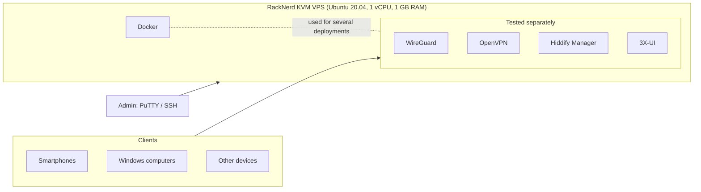

# Architecture

The experiments were run **one at a time** on the same VPS. They did not all run simultaneously.

```mermaid
flowchart LR
    subgraph Clients
        P[Smartphones]
        W[Windows computers]
        O[Other devices]
    end

    subgraph VPS["RackNerd KVM VPS (Ubuntu 20.04, 1 vCPU, 1 GB RAM)"]
        subgraph Experiments["Tested separately"]
            WG[WireGuard]
            OV[OpenVPN]
            HM[Hiddify Manager]
            XU[3X-UI]
        end
        D[Docker] -. used for several deployments .- Experiments
    end

    A[Admin: PuTTY / SSH] --> VPS
    Clients --> Experiments
```
